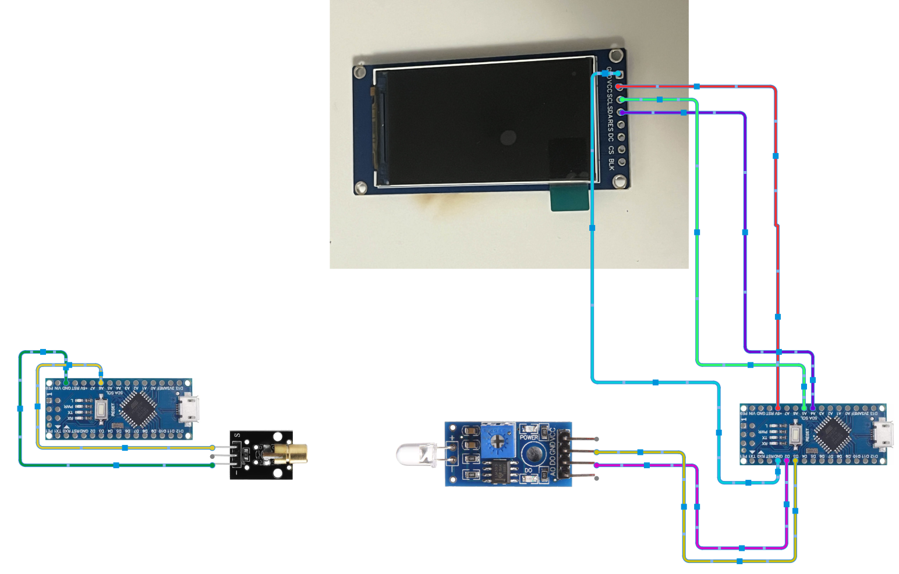

# Laser Optical Transceiver (ASCII-to-Binary) 🔦📶

### Overview

This project is an embedded optical communication system that transmits digital text messages across physical space using a laser beam. The system encodes standard ASCII characters into binary light pulses, transmits them via a laser diode, and decodes the incoming light fluctuations back into human-readable text on an I2C LCD screen.

### 🔬 Applications in Research & Signal Processing

This project is a fundamental demonstration of **Physical Data Transmission**, **Signal Encoding**, and **Noise Mitigation**. Transmitting data via light requires strict timing tolerances and thresholding logic to differentiate the true signal from ambient light noise. These principles are directly applicable to:

* Low-noise electrical measurements and Lock-In Amplifier data acquisition.
* Managing signal-to-noise ratios (SNR) in hardware-level sensor readings.
* Building custom DAQ (Data Acquisition) interfaces for isolated lab equipment.

---

### 🏗️ System Architecture & Workflow

The system consists of two independent Arduino Nano nodes communicating via a one-way optical link:

1. **Encoding (Transmitter):** * A Python or Serial interface feeds ASCII text to the Arduino.
* The microcontroller parses the string and converts each character into an 8-bit binary array.
* A laser diode is triggered at precise microsecond intervals (Bit Delay) to physically transmit the 1s (High) and 0s (Low).

2. **Decoding (Receiver):** * A light sensor module monitors ambient light levels.
* Upon detecting the "Start Bit," the receiver samples the light intensity at the predefined bit rate.
* Thresholding logic distinguishes the intentional laser pulses from background noise, reassembling the bits into ASCII characters.

3. **Output Interface:** * The reconstructed message is pushed to a 16x2 I2C LCD display for real-time viewing and mirrored to the Serial Monitor for logging.

---

### 📂 Repository Structure

* `Transmitter/transmitter.ino`: The C++ logic for ASCII-to-Binary conversion and laser PWM control.
* `Receiver/receiver.ino`: The C++ logic for signal detection, binary-to-ASCII reconstruction, and I2C LCD interfacing.
* `Circuit_Diagram.png`: Hardware wiring schematic for both nodes. 
---

### 🛠️ Hardware Requirements

* 2x Arduino Nano (or equivalent AVR microcontrollers)
* 1x 5V Laser Diode Module
* 1x Light Sensor Module (Photodiode/LDR with digital out)
* 1x 16x2 LCD Display with I2C Backpack
* Jumper wires and breadboards

---

### 🚀 Setup & Troubleshooting Tips

* **Baud Rate Alignment:** Ensure the Serial Monitor is set to exactly `9600 baud`. Mismatched baud rates between the transmitter and the receiver will result in weird characters appearing on the screen when receiving data.
* **Upload Configuration:** Ensure the correct board and processor architecture are selected in the Arduino IDE to prevent "wrong chip argument" errors during compilation and flashing.
* **Ambient Noise:** If the receiver is dropping characters, adjust the physical potentiometer on the light sensor module to change the trigger threshold, or shield the sensor from direct overhead room lighting.
